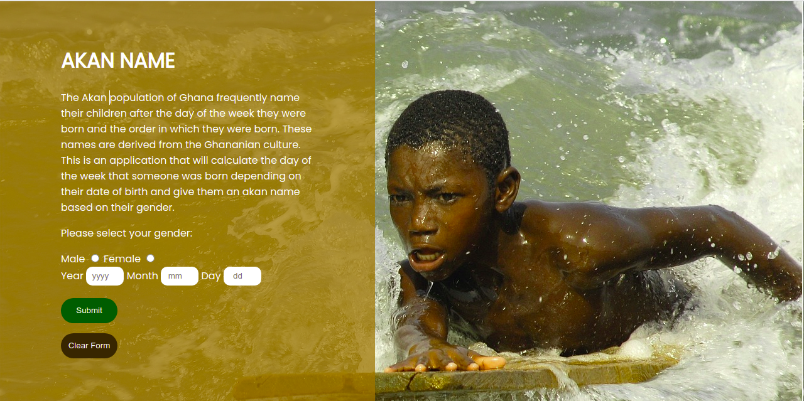

## Akan Name Generator

This is a site to generate Ghananian names based on the gender and the day of the week someone was born, 05/09/2021.

By Khajira Christopher

## Description
The Akan people of Ghana normally name their children after the day of the week they were born. The website takes in the gender and the date of birth through a form. From this, it is able to determine the day of the week the person was born and provide the Akan Name. 
The male Akan names include:
Sunday: Kwasi, Monday: Kwadwo, Tuesday: Kwabena, Wednesday: Kwaku, Thursday:  Yaw, Friday: Kofi, Saturday: Kwame
The female Akan names include:
Sunday: Akosua, Monday: Adwoa, Tuesday: Abenaa, Wednesday: Akua, Thursday:  Yaa, Friday: Afua, Saturday: Ama

## Features Summary
Below is a brief summary of the features that the website provides:
- Input the gender (Either male or female)
- Input the year
- Input the month (must not be less than 1 and must not be more than 12)
- Input the day (must not be less than 1 and must not be more than 31)
- Output the Akan name

## Setup/Installation Requirements
1. Clone the project using git clone https://github.com/Ckhajira/akan-names. If you are not able to clone it, you can download the files as a zip folder

2. Ensure that you have the complete file

3. Navigate to the index.html file which is in the root file of the folder. The application uses HTML, CSS and JavaScript.

4. Copy the path of the index.html file to your browser and you will be able to access the application.

## Technologies Used
This project uses HTML, CSS and JavaScript.

## Project Design

## Support and contact details
If you have any issues or questions, you can get intouch with me through email: christopher.khajira@student.moringaschool.com. Please feel free to make any contributions to the code.

## License
MIT License
Permission is hereby granted, free of charge, to any person obtaining a copy of this software and associated documentation files (the "Software"), to deal in the Software without restriction, including without limitation the rights to use, copy, modify, merge, publish, distribute, sublicense, and/or sell copies of the Software, and to permit persons to whom the Software is furnished to do so, subject to the following conditions:

The above copyright notice and this permission notice shall be included in all copies or substantial portions of the Software.

THE SOFTWARE IS PROVIDED "AS IS", WITHOUT WARRANTY OF ANY KIND, EXPRESS OR IMPLIED, INCLUDING BUT NOT LIMITED TO THE WARRANTIES OF MERCHANTABILITY, FITNESS FOR A PARTICULAR PURPOSE AND NONINFRINGEMENT. IN NO EVENT SHALL THE AUTHORS OR COPYRIGHT HOLDERS BE LIABLE FOR ANY CLAIM, DAMAGES OR OTHER LIABILITY, WHETHER IN AN ACTION OF CONTRACT, TORT OR OTHERWISE, ARISING FROM, OUT OF OR IN CONNECTION WITH THE SOFTWARE OR THE USE OR OTHER DEALINGS IN THE SOFTWARE.

Copyright (c) 2021 Khajira Christopher
